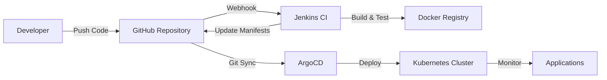

# 🚀 Jenkins + ArgoCD CI/CD Pipeline for SlashTEC Airport Services

## 📋 Overview

This project implements a complete GitOps CI/CD pipeline using **Jenkins** for Continuous Integration and **ArgoCD** for Continuous Deployment. The pipeline manages two microservices:

- **Airport Service**: Provides airport information and runway details
- **Country Service**: Provides country information and ISO codes

## 🏗️ Architecture



## 📁 Directory Structure

```
airporttask/
├── jenkins/                     # Jenkins pipeline configurations
│   ├── Jenkinsfile              # Airport service CI pipeline
│   └── country-service-jenkinsfile # Country service CI pipeline
├── docker/                      # Docker configurations
│   ├── Dockerfile               # Airport service Docker image
│   └── Dockerfile.country       # Country service Docker image
├── argo/                        # ArgoCD application manifests
│   ├── airport-service-app.yaml # Airport service ArgoCD app
│   └── argocd-project.yaml      # ArgoCD project configuration
├── helm/                        # Airport service Helm chart
│   ├── Chart.yaml
│   ├── values.yaml
│   └── templates/
├── helm-country/                # Country service Helm chart
│   ├── Chart.yaml
│   ├── values.yaml
│   └── templates/
└── interview-test/              # Application artifacts
    ├── airports-assembly-1.0.1.jar
    ├── airports-assembly-1.1.0.jar
    └── countries-assembly-1.0.1.jar
```

## 🔄 CI/CD Workflow

### Phase 1: Continuous Integration (Jenkins)

1. **Trigger**: Developer pushes code to `main` branch
2. **Build**: Jenkins pipeline starts automatically
3. **Test**: Application health checks and smoke tests
4. **Build Image**: Create Docker image with versioned tag
5. **Push Image**: Upload to Docker Hub registry
6. **Update Manifests**: Update Helm values with new image tag
7. **Commit**: Push updated manifests back to Git

### Phase 2: Continuous Deployment (ArgoCD)

1. **Detect**: ArgoCD monitors Git repository for changes
2. **Sync**: Automatically pulls updated Helm manifests
3. **Deploy**: Applies changes to Kubernetes cluster
4. **Monitor**: Ensures applications are healthy and running

## 🛠️ Setup Instructions

### Prerequisites

- Kubernetes cluster (minikube, kind, or cloud provider)
- Jenkins with Docker support
- ArgoCD installed on cluster
- Docker Hub account
- GitHub repository access

### 1. Jenkins Setup

#### Install Required Plugins
```bash
# Install Jenkins plugins
- Docker Pipeline
- Kubernetes
- Git
- Slack Notification (optional)
```

#### Configure Credentials
```bash
# Add to Jenkins credentials
- dockerhub-credentials: Docker Hub username/password
- git-credentials: GitHub username/token
- slack-webhook: Slack integration (optional)
```

#### Create Pipeline Jobs
1. **Airport Service Pipeline**:
   - New Item → Pipeline
   - Name: `airport-service-ci`
   - Pipeline script from SCM
   - Repository: Your GitHub repo
   - Script Path: `jenkins/Jenkinsfile`

2. **Country Service Pipeline**:
   - New Item → Pipeline  
   - Name: `country-service-ci`
   - Pipeline script from SCM
   - Script Path: `jenkins/country-service-jenkinsfile`

### 2. ArgoCD Setup

#### Install ArgoCD
```bash
kubectl create namespace argocd
kubectl apply -n argocd -f https://raw.githubusercontent.com/argoproj/argo-cd/stable/manifests/install.yaml
```

#### Access ArgoCD UI
```bash
# Get admin password
kubectl -n argocd get secret argocd-initial-admin-secret -o jsonpath="{.data.password}" | base64 -d

# Port forward to access UI
kubectl port-forward svc/argocd-server -n argocd 8080:443
```

#### Deploy Applications
```bash
# Apply ArgoCD project and applications
kubectl apply -f argo/argocd-project.yaml
kubectl apply -f argo/airport-service-app.yaml
```

### 3. Kubernetes Deployment

#### Create Namespace
```bash
kubectl create namespace drone
```

#### Deploy Services (via ArgoCD)
ArgoCD will automatically deploy both services once configured.

## 🚦 Pipeline Parameters

### Airport Service Pipeline
- **SERVICE_VERSION**: Choose between `1.0.1` or `1.1.0`
- **ENVIRONMENT**: Target deployment environment
- **SKIP_TESTS**: Skip test execution for faster builds

### Country Service Pipeline  
- **ENVIRONMENT**: Target deployment environment
- **SKIP_TESTS**: Skip test execution for faster builds

## 📊 Monitoring & Observability

### Health Endpoints
- **Airport Service**: `http://localhost:8000/health/live`
- **Country Service**: `http://localhost:8001/health/live`

### Application Endpoints
- **Airport Service**: 
  - `/airports` - List all airports
  - `/airports/<query>` - Search airports by country code
- **Country Service**:
  - `/countries` - List all countries
  - `/countries/<query>` - Search countries

### ArgoCD Dashboard
- Monitor deployment status
- View sync history
- Manage applications
- Check resource health

## 🔒 Security Best Practices

### Docker Images
- ✅ Non-root user execution
- ✅ Health checks implemented
- ✅ Minimal base images (Alpine)
- ✅ Security scanning integration

### Kubernetes
- ✅ Resource limits defined
- ✅ Network policies (recommended)
- ✅ RBAC permissions
- ✅ Secret management

### Git Security
- ✅ Signed commits (recommended)
- ✅ Branch protection rules
- ✅ Automated security scanning
- ✅ Credential rotation

## 🚀 Deployment Commands

### Manual Deployment
```bash
# Deploy airport service
helm upgrade --install airport-service ./helm -n drone

# Deploy country service  
helm upgrade --install country-service ./helm-country -n drone
```

### Pipeline Trigger
```bash
# Trigger Jenkins build
curl -X POST "http://jenkins:8080/job/airport-service-ci/build" \
  --user admin:token

# Force ArgoCD sync
argocd app sync airport-service
```

### Rollback
```bash
# Helm rollback
helm rollback airport-service 1 -n drone

# ArgoCD rollback
argocd app rollback airport-service
```

## 🐛 Troubleshooting

### Common Issues

#### Pipeline Failures
```bash
# Check Jenkins logs
docker logs jenkins

# Check build logs in Jenkins UI
```

#### ArgoCD Sync Issues
```bash
# Check ArgoCD application status
kubectl get applications -n argocd

# View application details
argocd app get airport-service
```

#### Pod Failures
```bash
# Check pod status
kubectl get pods -n drone

# View pod logs
kubectl logs -f deployment/airport-service -n drone
```

### Health Checks

```bash
# Test application health
curl http://localhost:8000/health/live
curl http://localhost:8000/airports | jq '.[0]'

# Check service connectivity
kubectl port-forward -n drone svc/airport-service 8000:8000
```

## 📈 Scaling & Performance

### Horizontal Pod Autoscaling
Both services are configured with HPA:
- Min replicas: 1
- Max replicas: 3 (country), 1 (airport)
- CPU threshold: 80%

### Resource Requirements
- **CPU**: 100m (requests)
- **Memory**: 200m (requests)
- **Storage**: Ephemeral only

## 🤝 Contributing

1. Fork the repository
2. Create feature branch (`git checkout -b feature/amazing-feature`)
3. Commit changes (`git commit -m 'Add amazing feature'`)
4. Push to branch (`git push origin feature/amazing-feature`)
5. Open Pull Request

## 📞 Support

For issues and questions:
- 📧 Email: devops@slashtec.com
- 💬 Slack: #devops-support
- 🐛 Issues: GitHub Issues tab

---

**Happy Deploying! 🚀**
