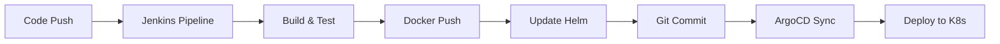

# 🚀 Jenkins Pipeline Configuration

## 📋 Pipeline Overview

This directory contains professional Jenkins pipelines adapted from production-grade enterprise structure for SlashTEC Airport Services.

## 📁 Pipeline Files

### 🛬 Airport Service Pipeline
- **File**: `airport-service-pipeline`
- **Purpose**: Build and deploy Airport Service (versions 1.0.1/1.1.0)
- **Features**: Health checks, Docker build/push, Helm updates, Git commits

### 🌍 Country Service Pipeline  
- **File**: `country-service-pipeline`
- **Purpose**: Build and deploy Country Service (version 1.0.1)
- **Features**: Health checks, Docker build/push, Helm updates, Git commits

## 🎛️ Pipeline Parameters

### Airport Service Parameters
```groovy
BranchName: "main"           // Git branch to build from
Environment: "production"    // Target environment
ServiceName: "airport-service" // Service identifier
AirportVersion: "1.1.0"     // Airport service version
Tag: "latest"               // Optional tag override
```

### Country Service Parameters
```groovy
BranchName: "main"          // Git branch to build from  
Environment: "production"   // Target environment
Tag: "latest"              // Optional tag override
```

## 🔐 Required Jenkins Credentials

### Configure these in Jenkins Credentials:

1. **`slack-webhook`** (Secret Text)
   ```
   Slack webhook URL for notifications
   ```

2. **`dockerhub-credentials`** (Username/Password)
   ```
   Username: malikslashtec
   Password: <Docker Hub access token>
   ```

3. **`git-credentials`** (Username/Password)
   ```
   Username: <GitHub username>
   Password: <GitHub personal access token>
   ```

## 🏗️ Pipeline Stages

### 1. **Cleanup Workspace**
- Cleans Jenkins workspace
- Prepares clean environment

### 2. **Checkout Source Code**
- Clones repository from specified branch
- Generates Git commit hash
- Creates versioned image tag

### 3. **Prepare Build Artifacts**
- Copies appropriate JAR file to Docker context
- Airport: `airports-assembly-{version}.jar`
- Country: `countries-assembly-1.0.1.jar`

### 4. **Test Application Health**
- Starts service temporarily
- Performs health check on `/health/live`
- Validates service functionality

### 5. **Docker Registry Login**
- Authenticates with Docker Hub
- Prepares for image push

### 6. **Build Docker Image**
- Builds service-specific Docker image
- Tags with version and commit hash
- Creates `latest` tag

### 7. **Push Docker Image**
- Pushes versioned image to Docker Hub
- Pushes latest tag for convenience

### 8. **Clean Local Docker Images**
- Removes local images to save space
- Runs Docker system cleanup

### 9. **Update Helm Chart Values**
- Uses `yq` to update `helm-unified/values.yaml`
- Updates appropriate service image tag
- Backs up original values

### 10. **Commit and Push Changes**
- Commits updated Helm values to Git
- Pushes changes to trigger ArgoCD sync
- Includes `[skip ci]` to prevent loop

### 11. **Trigger Related Services** (Airport only)
- Optionally triggers Country Service build
- Maintains service deployment order

### 12. **Verify ArgoCD Sync**
- Confirms ArgoCD will detect changes
- Displays deployment summary

## 📊 Pipeline Features

### ✅ **Enterprise-Grade Error Handling**
- Proper exception catching
- Graceful failure handling  
- Detailed error reporting

### ✅ **Professional Notifications**
- Slack integration with color coding
- Build status notifications
- Deployment summaries

### ✅ **Advanced Git Integration**
- Automatic Helm values updates
- Commit message standards
- Skip CI tags to prevent loops

### ✅ **Docker Best Practices**
- Multi-stage image tagging
- Registry authentication
- Cleanup after builds

### ✅ **Health Validation**
- Service startup verification
- Endpoint health checks
- Build failure on health issues

## 🚀 Usage Examples

### Creating Jenkins Jobs

#### Airport Service Job
1. New Item → Pipeline
2. Name: `airport-service-ci`
3. Pipeline → Pipeline Script from SCM
4. Repository: `https://github.com/malikalaja/slashTEC.git`
5. Script Path: `jenkins/airport-service-pipeline`

#### Country Service Job
1. New Item → Pipeline
2. Name: `country-service-ci`
3. Pipeline → Pipeline Script from SCM
4. Script Path: `jenkins/country-service-pipeline`

### Manual Triggers
```bash
# Trigger via Jenkins CLI
java -jar jenkins-cli.jar build airport-service-ci \
  -p BranchName=main \
  -p Environment=production \
  -p AirportVersion=1.1.0

# Trigger via curl
curl -X POST "http://jenkins:8080/job/airport-service-ci/buildWithParameters" \
  --user admin:token \
  --data "BranchName=main&Environment=production&AirportVersion=1.1.0"
```

## 🔄 GitOps Workflow



## 📈 Monitoring & Troubleshooting

### Pipeline Logs
- Check Jenkins build console output
- Look for emoji indicators for stage status
- Review archived `values.yaml` files

### Common Issues
1. **Health Check Failures**: Check JAR file availability
2. **Docker Push Errors**: Verify Docker Hub credentials
3. **Git Push Failures**: Check Git credentials and permissions
4. **Slack Notifications**: Verify webhook URL configuration

### Debug Commands
```bash
# Test health endpoint locally
curl http://localhost:8080/health/live

# Check Docker image
docker images | grep airport-service

# Verify Helm values update
cat helm-unified/values.yaml | grep -A5 airportService
```

## 🎯 Production Deployment

### Prerequisites
- Jenkins server with Docker support
- Docker Hub account configured
- GitHub repository access
- Slack webhook (optional)
- ArgoCD deployed and configured

### Deployment Checklist
- [ ] Jenkins credentials configured
- [ ] Pipeline jobs created
- [ ] Webhook triggers set up
- [ ] ArgoCD applications deployed
- [ ] Slack channels configured
- [ ] Health check endpoints verified

---

**🏆 This pipeline structure follows enterprise DevOps best practices and is production-ready!**
